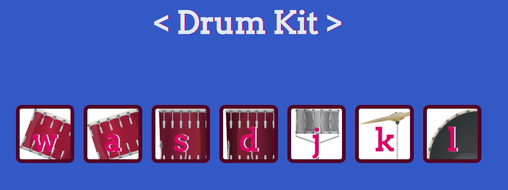

# Drumkit 🥁 - Unleash Your Inner Drummer

<em>&nbsp; (Tap on this drum to view the project)</em>

 

# Overview
Welcome to <strong>Drumkit</strong> – a fun and interactive web app that turns your keyboard into a drum set. This project allows users to play various drum sounds with the click of a button or by pressing corresponding keys on their keyboard. Through this project, I explored event handling in JavaScript, making a simple yet engaging musical instrument.

 

# Technologies Used

  

 

# Features
This project has the following features:

<ul>
    <li><strong>Interactive Drum Sounds:</strong> Play different drum sounds by clicking buttons or pressing keys ('w', 'a', 's', 'd', 'j', 'k', 'l').</li>
    <li><strong>Visual Feedback:</strong> Buttons provide visual feedback when pressed, enhancing the interactive experience.</li>
    <li><strong>Simple Interface:</strong> Clean and intuitive interface for a straightforward user experience.</li>
    <li><strong>GitHub Repository:</strong> Explore the code and contribute via the project's GitHub repository.</li>
</ul>

 

# Learnings:

Here are the key learnings from the Drumkit project:

<ul>
    <li><strong>Event Handling:</strong> Gained experience with handling different types of events such as 'click' and 'keydown' to trigger actions in the app.</li>
    <li><strong>Audio Management:</strong> Learned to play audio files dynamically based on user interactions.</li>
    <li><strong>DOM Manipulation:</strong> Enhanced skills in manipulating the DOM to create interactive web elements.</li>
    <li><strong>Responsive Design:</strong> Ensured the drumkit works smoothly across different devices and screen sizes.</li>
    <li><strong>JavaScript Proficiency:</strong> Strengthened JavaScript skills by implementing interactive features and visual feedback.</li>
</ul>

 

# Conclusion

Thanks for checking out Drumkit, where making music is as easy as pressing a button! This project dives into JavaScript event handling, audio management, and interactive web design to provide a fun musical experience. Enjoy creating your own beats and exploring the code.

Feel free to dive into the code, contribute, or use it for educational purposes. Your feedback and contributions are immensely valuable.

  

  Keep drumming! 🥁🎶

